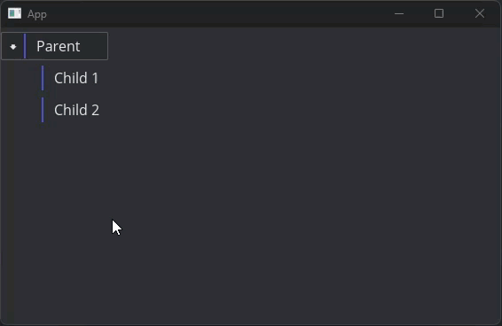
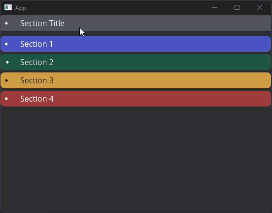
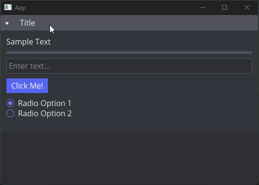
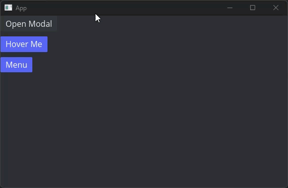
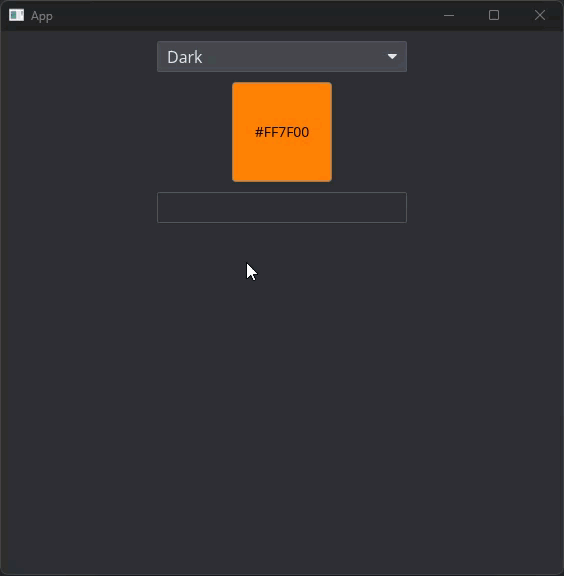

# AD Widgets for Iced

A collection of custom widgets for the [iced-rs](https://github.com/iced-rs/iced) GUI library version 0.14.0.

## TL:DR

- **Tree Widget**: Hierarchical display with drag-and-drop reordering, multi-selection, and keyboard navigation
- **Collapsible**: Expandable/collapsible containers with smooth animations and accordion grouping
- **Generic Overlay**: Flexible overlay system for modals, tooltips, and dropdown menus
- **Color Picker**: Full-featured color selection with palette integration and theme code generation

## Widgets

### Tree Widget

A hierarchical tree view widget with comprehensive interaction support.

**Features:**
- Hierarchical data display with expand/collapse functionality
- Multi-selection with Shift and Ctrl/Cmd key support
- Drag-and-drop reordering with visual feedback
- Keyboard navigation (arrow keys, Enter, Space)
- Custom expand/collapse icons
- Configurable indentation and spacing
- Per-branch drop target control
- Optional drag blocking for specific branches

**Basic Usage:**
```rust
use widgets::tree::{branch, tree_handle, DropInfo};

let tree = tree_handle(vec![
    branch(text("Parent"))
        .with_id(1)
        .with_children(vec![
            branch(text("Child 1")).with_id(2),
            branch(text("Child 2")).with_id(3),
        ])
        .accepts_drops(),
])
.on_drop(|optional_branch_id| Message::HandleDrop)
.on_select(|optional_branch_id| Message::HandleSelect);
```


### Collapsible

An animated collapsible container with support for both standalone and grouped (accordion) behavior.

**Features:**
- Self-managed expand/collapse state
- Smooth animations with configurable easing and duration
- Accordion groups (only one open at a time)
- Customizable header styling
- Optional action icons in header
- Configurable click behavior (full header or icon only)
- Built-in style presets (primary, success, danger, warning)

**Basic Usage:**
```rust
use widgets::collapsible::collapsible;
use widgets::collapsible_group;
use widgets::collapsible::{success, warning, primary, danger};

// Standalone collapsible
let standalone = collapsible(
    "Section Title",
    text("Content goes here")
);

// Grouped (accordion) behavior
let group = collapsible_group![
    collapsible("Section 1", text("Any Element")).style(primary),
    collapsible("Section 2", button("Can be in the collapsible")).style(success).padding(10),
    collapsible("Section 3", container(column![text("A"), text("B")])).style(warning),
    collapsible("Section 4", text("helper style functions provided")).style(danger),
].spacing(5.0);

column![
    standalone,
    group
].spacing(10).into()
```



**Animation Controls:**
```rust
collapsible("Title", content)
    .easing(iced::animation::Easing::EaseInOutCubic)
    .duration(Duration::from_millis(300))
    .expanded(true)  // Start expanded
```


### Generic Overlay

A flexible overlay system for creating modals, tooltips, and dropdown menus.

**Features:**
- Modal overlays with draggable positioning
- Hover-to-open tooltips
- Dropdown menu support
- Resizable overlays
- Click-outside-to-close behavior
- Viewport-aware positioning
- Custom header styling or headerless mode
- Nested overlay support

**Basic Usage:**
```rust
use widgets::generic_overlay::{dropdown_menu, dropdown_root, interactive_tooltip, overlay_button, ResizeMode};

// Modal overlay
let modal = overlay_button(
    "Open Modal",
    "Modal Title",
    text("Modal content")
)
.resizable(ResizeMode::Always) // can make them resizeable
.style(button::subtle); // Uses built in button styles

// Interactive tooltip
let tooltip = interactive_tooltip(
    "Hover Me",
    text("Tooltip content")
);

// Dropdown menu
let dropdown = dropdown_root(
    "Menu",
    column![
        button("Option 1").width(Length::Fill),
        button("Option 2").width(Length::Fill),
        button("Option 3").width(Length::Fill),
        dropdown_menu(
            "nested_menu", 
            column![
                button("Option 1").width(Length::Fill),
                button("Option 2").width(Length::Fill),
                button("Option 3").width(Length::Fill),                        
            ]
        )
    ]
).width(Length::Shrink);

column![
    modal,
    tooltip,
    dropdown,
]
.spacing(10.0)
.into()
```


### Color Picker

A color picker widget with palette management and theme integration.

**Features:**
- Multiple color input methods (HSV picker, RGB sliders, hex input)
- Tabbed interface for different selection modes
- Palette tab with saved colors
- Theme code generation (generates iced theme code)
- Alpha channel support
- Color preview with contrast-aware text
- Click-to-select from palette
- Persistent color storage

**Basic Usage:**
```rust
use widgets::color_picker::color_button;

let picker = color_button(Color::from_rgb(1.0, 0.5, 0.0))
    .title("Choose Color")
    .on_change(Message::ColorChanged)
    .show_hex(true);
```

## Installation

Add this to your `Cargo.toml`:

```toml
[dependencies]
iced = { git = "https://github.com/iced-rs/iced", branch = "0.14.0" }
widgets = { git = "https://github.com/A-Disruption/widgets.git" }
```

Enable the widgets you need with feature flags:

```toml
[dependencies]
widgets = { git = "https://github.com/A-Disruption/widgets.git" , features = ["tree", "collapsible", "generic_overlay", "color_picker"] }
```

## Examples

The repository includes working examples for each widget:

- `tree_example.rs` - Basic tree widget usage
- `collapsible_example.rs` - Standalone and grouped collapsibles
- `tree_in_collapsible_example.rs` - Combining tree and collapsible widgets
- `generic_overlay_example.rs` - Various overlay types
- `color_picker_example.rs` - Color picker with palette management

Run an example:
```bash
cargo run --example tree_example --features tree
```
